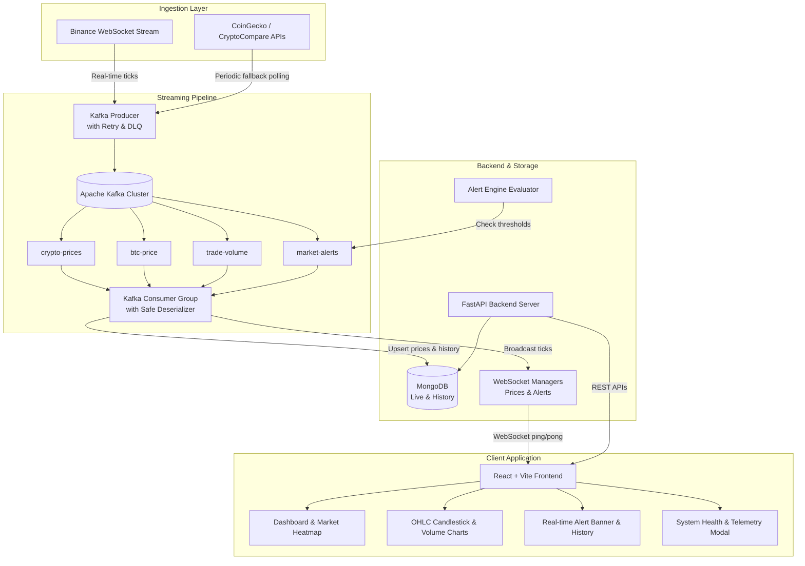

# 🚀 CryptoPulse: Real-Time Cryptocurrency Monitoring System

CryptoPulse is an enterprise-grade, event-driven cryptocurrency intelligence and monitoring platform. It streams live market data from top-tier exchanges, processes millions of ticks through an Apache Kafka streaming pipeline, persists high-resolution time-series data to MongoDB, and broadcasts real-time updates to an interactive React dashboard via WebSockets.

---

## 🏛️ System Architecture



---

## ✨ Key Capabilities & Features

1. **Live High-Frequency Streaming**:
   - Millisecond-level ticker feeds for core assets: **Bitcoin (BTC)**, **Ethereum (ETH)**, and **Solana (SOL)** directly from Binance WebSocket streams.
   - Resilient multi-source fallback ingestion via CoinGecko and CryptoCompare.

2. **Event-Driven Apache Kafka Pipeline**:
   - Partitioned and fault-tolerant streaming architecture across 4 dedicated topics:
     - `crypto-prices`: Unified real-time price tick stream.
     - `btc-price`: Dedicated low-latency Bitcoin channel.
     - `trade-volume`: 24h volume tracking and anomaly detection.
     - `market-alerts`: Event-driven threshold breaches.
   - Built-in exponential backoff retries, dead-letter queue (DLQ) buffers, and safe deserialization preventing message loss.

3. **Interactive Market Intelligence**:
   - **Market Heatmap**: Real-time tile color shading reflecting 24h price momentum and percentage swings.
   - **OHLC Candlestick Charting**: Multi-timeframe aggregation (`1m`, `5m`, `15m`, `1h`) with 5-period and 10-period Simple Moving Averages (SMA).
   - **Trading Volume Analytics**: Multi-coin volume distribution, volume-to-market-cap ratio, and spike detection alerts.
   - **Comparative Performance**: Normalized percentage growth comparisons across tracked cryptocurrencies.

4. **Alert Engine & Push Notifications**:
   - User-configurable alerts for price ceilings, floors, and volume conditions.
   - Triggered alerts are published instantly through Kafka and pushed to connected browser clients via WebSocket toasts.

5. **Infrastructure Health & Telemetry**:
   - Interactive System Architecture modal displaying live connectivity, ping latency, and document counts for MongoDB, Kafka, Binance streams, and WebSocket clients.

6. **UI Polish & Theme Synchronization**:
   - Light, Dark, and System appearance modes synchronized across all views without page reloads.

---

## 🛠️ Technology Stack

| Layer | Technologies |
| :--- | :--- |
| **Frontend** | React 19, Vite, React Router, Recharts, Chart.js, CSS Variables |
| **Backend** | FastAPI, Uvicorn, Python 3.10+, Pydantic, Motor (Async MongoDB), PyMongo |
| **Messaging** | Apache Kafka, Zookeeper, `kafka-python` |
| **Database** | MongoDB 6.0+ |
| **Live Ingestion** | Binance WebSocket API (`wss://stream.binance.com:9443`), CoinGecko REST API, CryptoCompare REST API |
| **Containerization** | Docker, Docker Compose |

---

## 📋 Kafka Topics Specification

| Topic | Description | Retention / Policy |
| :--- | :--- | :--- |
| `crypto-prices` | Primary stream containing price, volume, and 24h stats for all tracked assets | Compact / Delete |
| `btc-price` | Dedicated stream for Bitcoin real-time ticks | Standard |
| `trade-volume` | Stream dedicated to trading volume metrics and liquidity tracking | Standard |
| `market-alerts` | Event-driven stream publishing triggered user alert notifications | Standard |

---

## 🚀 Getting Started

### Option A: Running via Docker Compose (Recommended)

To start the full stack including MongoDB, Kafka, Backend, and Frontend:

```bash
# Clone repository
git clone https://github.com/your-org/cryptopulse.git
cd cryptopulse

# Start all services
docker-compose up --build
```

Access services:
- **Frontend UI**: `http://localhost:5173`
- **FastAPI Documentation**: `http://localhost:8000/docs`
- **Detailed Health Check**: `http://localhost:8000/health/detailed`

---

### Option B: Local Development Setup

#### 1. Start Infrastructure Services
Start Kafka and MongoDB in Docker:
```bash
docker-compose up -d mongo zookeeper kafka
```

#### 2. Backend Setup
```bash
cd backend
python -m venv venv
venv\Scripts\activate  # On Windows (or source venv/bin/activate on Linux/Mac)
pip install -r requirements.txt

# Run FastAPI backend
uvicorn main:app --reload --host 0.0.0.0 --port 8000
```

#### 3. Frontend Setup
```bash
cd frontend
npm install
npm run dev
```

---

## ⚙️ Environment Variables Reference

| Variable | Default Value | Description |
| :--- | :--- | :--- |
| `MONGO_URI` | `mongodb://localhost:27017` | MongoDB connection URI |
| `DATABASE_NAME` | `cryptopulse_db` | Primary database name |
| `KAFKA_BOOTSTRAP_SERVERS` | `localhost:9092` | Kafka broker host and port |
| `KAFKA_TOPIC` | `crypto-prices` | Primary crypto prices topic |
| `BTC_PRICE_TOPIC` | `btc-price` | Bitcoin price topic |
| `MARKET_ALERTS_TOPIC` | `market-alerts` | Triggered alert notifications topic |
| `TRADE_VOLUME_TOPIC` | `trade-volume` | Trading volume topic |
| `SUPPORTED_COINS` | `bitcoin,ethereum,solana` | Comma-separated list of active coins |
| `BINANCE_WS_URL` | `wss://stream.binance.com:9443/stream` | Binance live ticker stream endpoint |
| `SECRET_KEY` | `cryptopulse_secret_key_2026` | JWT secret key for token generation |
| `ACCESS_TOKEN_EXPIRE_MINUTES` | `30` | JWT token validity lifespan |
| `ADMIN_EMAIL` | `dharmika@cryptopulse.com` | Default seeded admin email |
| `ADMIN_PASSWORD` | `Admin@123` | Default seeded admin password |

---

## 🔌 API & WebSocket Documentation

### REST Endpoints

| Category | Endpoint | Method | Description |
| :--- | :--- | :--- | :--- |
| **Health** | `/health` | `GET` | Basic API liveness probe |
| **Health** | `/health/detailed` | `GET` | Deep status check (Mongo, Kafka, Binance, WebSockets) |
| **Prices** | `/prices/latest` | `GET` | Latest prices and 24h statistics |
| **Prices** | `/prices/history` | `GET` | Historical time-series price data |
| **Analytics** | `/analytics/heatmap` | `GET` | Relative performance and intensity scoring |
| **Analytics** | `/analytics/ohlc/{coin}` | `GET` | Aggregated candlesticks (1m, 5m, 15m, 1h) & SMAs |
| **Analytics** | `/analytics/comparative` | `GET` | Normalized comparative performance trends |
| **Analytics** | `/analytics/volume` | `GET` | Volume distribution & spike analysis |
| **Alerts** | `/alerts/` | `GET` / `POST` | Manage user price alerts |
| **Auth** | `/auth/signup` | `POST` | Create new user account |
| **Auth** | `/auth/login` | `POST` | Authenticate and obtain JWT token |
| **Admin** | `/admin/coins` | `GET` / `POST` | Admin supported coin configuration |

### WebSocket Endpoints

- **`ws://localhost:8000/prices/ws`**: Real-time live price and volume streaming.
  - Sends ping/pong heartbeats every 30 seconds (`{"type": "ping"}` / `{"type": "pong"}`).
- **`ws://localhost:8000/alerts/ws`**: Real-time push notifications when market alert conditions trigger.

---

## 🧪 Verification & Testing

Verify system components:

```bash
# Verify backend configuration & health
python -c "import sys; sys.path.insert(0, 'backend'); from config.settings import validate_configuration; print(validate_configuration())"

# Test frontend production build
cd frontend && npm run build
```

---

## 📄 License
This project is licensed under the MIT License.
